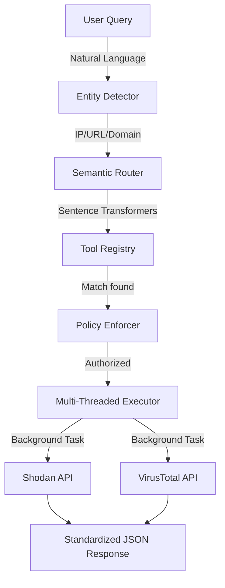

# 🦅 Athena (v1.2)

[](https://modelcontextprotocol.io)
[](https://python.org)
[](LICENSE)

Athena is a high-performance **Model Context Protocol (MCP)** server Runtime designed for autonomous threat intelligence orchestration. It bridges the gap between natural language security queries and technical intelligence APIs like Shodan and VirusTotal.

## 🚀 What's New in v1.2?

- **Analyst-Augmented Output**: Responses now use a three-lane structure: `observed_facts` (Athena-provided), `analyst_interpretation` (LLM-rendered), and `recommended_next_steps` (LLM-rendered).
- **Senior CTI Persona Prompt**: LLMs must request the `senior_cti_analyst` MCP Prompt at session startup to inject the Senior CTI Analyst persona.
- **Audit Hashing**: Every response includes a `persona_hash` (SHA256) in the audit block for verification.
- **Clean Separation of Authority**: Athena provides authoritative facts; the LLM provides interpretive analysis. Never the other way around.
- **Schema Version Flags**: All responses include `version: "1.2"` and `rendering_mode: "analyst_augmented"`.
- **Enhanced Guardrails**: The persona explicitly prohibits the LLM from claiming execution, issuing verdicts, or fabricating data.

---

## 🛡️ Security & Auditing

Athena is built for high-security environments. We **highly encourage** users to monitor their audit logs:
- **Location**: `logs/audit.jsonl`
- **What's tracked**: Every query, detected entity, tool selected, confidence score, and raw API response.
- **Best Practice**: Feed this file into your SIEM or a local monitoring dashboard to track agentic behavior and catch malicious queries in real-time.

---

## 🛠️ System Architecture

Our architecture is built for extreme scalability and "Imagination-driven" growth.



### The 3-Layer Logic:
1.  **Deterministic Entity Detection**: Regex-based classification of Technical Identifiers (IPs, URLs, Domains, **and Hashes**).
2.  **Semantic Intent Matching**: Using `all-MiniLM-L6-v2` to match conversational "vibes" to technical tool capabilities with a configurable threshold.
3.  **Encapsulated Policy Layer**: Ensures API keys, rate limits, and credit tiers are respected before any network call is made.

---

## 🛠️ Tools Included

| Tool | Trigger Intent (Examples) | Input Entity | Key Required | Risk Tier |
|------|---------------------------|--------------|--------------|-----------|
| **Shodan IP** | "where is this ip", "ports on 1.1.1.1" | Public IP | Yes | Low |
| **VirusTotal Audit**| "scan vt", "is this hash malicious" | URL, Hash | Yes | Medium |
| **AbuseIPDB** | "check ip for abuse", "reputation of IP" | Public IP | Yes | Low |
| **ThreatFox** | "malware hash", "ioc on threatfox" | IP, Domain, URL, Hash | Yes (Auth-Key) | Low |

## 🚀 Getting Started

### 1. Requirements
- Python 3.10+
- Pip
- API Keys for Shodan and/or VirusTotal (for now, more tools to come!)

### 2. Basic Installation

> [!WARNING]
> This project is designed to be lightweight. **Do NOT install the CUDA/GPU version of PyTorch**, as it will significantly increase the environment size and may cause compatibility issues. Use the CPU-only version as shown below.

```bash
# Clone the repository
git clone https://github.com/ranjeetreddy14/Athena-mcp.git
cd Athena-mcp

# Setup Virtual Environment
python -m venv .venv
source .venv/bin/activate  # Windows: .venv\Scripts\activate

# Install Dependencies (Lightweight CPU-only)
pip install torch --index-url https://download.pytorch.org/whl/cpu
pip install -r requirements.txt
```

### 3. Configuration
Create a `.env` file in the root directory:
```env
SHODAN_API_KEY=your_shodan_key
VT_API_KEY=your_vt_key
ROUTER_THRESHOLD=0.20
```

---

## 📂 Project Structure
- `server.py`: The MCP entry point & stdio handler.
- `orchestrator/`: The "Brain" (Router, Registry, Logic).
- `tools/`: Atomic implementations of TI lookups.
- `registry/`: Intent phrases & tool definitions (`tools.json`).
- `logs/`: Persistent JSON auditing for security review.

---

## 🧩 Adding Custom Tools

Athena is designed for extreme extensibility. You can add your own private intelligence sources in minutes.

### 1. Create the Tool Script
Add a new file in `tools/` (e.g., `tools/misp_tool.py`):
```python
import os
import requests

def execute(observable: str) -> dict:
    # Athena automatically passes the detected IP/URL/Hash here
    api_key = os.getenv('MY_API_KEY')
    # Use requests to fetch data and return a flat dictionary
    return {"status": "ok", "verdict": "safe", "data": {...}}
```

### 2. Register Your Tool
Add an entry to `registry/tools.json`:
```json
{
  "name": "my_custom_tool",
  "input_types": ["ip", "hash"],
  "intents": [
    "check my internal database for this ip",
    "search misp for hash",
    "has our SOC seen this before"
  ],
  "risk_tier": "low",
  "requires_user_approval": false,
  "enabled": true,
  "requires_api_key": true,
  "env_var_name": "MY_API_KEY"
}
```

### 3. Restart & Profit
Restart the Athena server. The Sentence Transformers model will automatically encode your new intents, and Athena will begin routing relevant queries to your tool immediately.

---

## 📜 License & Rights
This project is licensed under the MIT License - see the [LICENSE](LICENSE) file for details.

**Copyright (c) 2025 Ranjeet Reddy Manchana**

> [!NOTE]
> The author reserves the right to change the license or move to a closed-source model for future releases at their discretion.

---

*“Imagination is the key for scalability.”* – Created by **Ranjeet Reddy Manchana** for the next generation of agentic defense.
