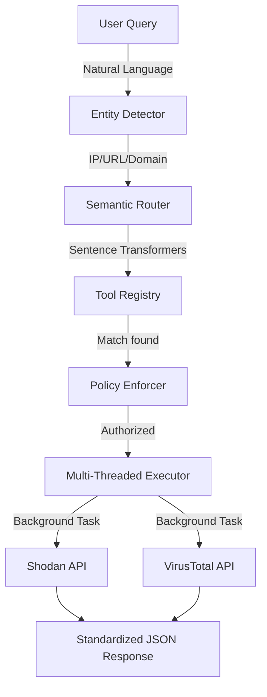

# 🦅 Threat Intel MCP Server (v1)

[](https://modelcontextprotocol.io)
[](https://python.org)
[](LICENSE)

A high-performance **Model Context Protocol (MCP)** server designed for autonomous threat intelligence orchestration. It bridges the gap between natural language security queries and technical intelligence APIs like Shodan and VirusTotal.

## 🌟 Why this matters?

Modern LLMs struggle with deterministic tool use and routing when multiple security tools are involved. This server implements a **3-Layer Security-First Router** that ensures queries are handled with technical precision, multi-threaded responsiveness, and zero "hallucination" in the routing loop.

---

## 🛠️ System Architecture

Our architecture is built for extreme scalability and "Imagination-driven" growth.



### The 3-Layer Logic:
1.  **Deterministic Entity Detection**: Regex-based classification of Technical Identifiers (IPs, URLs, Domains).
2.  **Semantic Intent Matching**: Using `all-MiniLM-L6-v2` to match conversational "vibes" to technical tool capabilities with a configurable threshold.
3.  **Encapsulated Policy Layer**: Ensures API keys, rate limits, and credit tiers are respected before any network call is made.

---

## 🚀 Getting Started

### 1. Requirements
- Python 3.10+
- Pip
- API Keys for Shodan and/or VirusTotal (for now, more tools to come!)

### 2. Basic Installation

> [!WARNING]
> This project is designed to be lightweight. **Do NOT install the CUDA/GPU version of PyTorch**, as it will significantly increase the environment size and may cause compatibility issues. Use the CPU-only version as shown below.

```bash
# Clone the repository
git clone https://github.com/[your-username]/threat-intel-mcp.git
cd threat-intel-mcp

# Setup Virtual Environment
python -m venv .venv
source .venv/bin/activate  # Windows: .venv\Scripts\activate

# Install Dependencies (Lightweight CPU-only)
pip install torch --index-url https://download.pytorch.org/whl/cpu
pip install -r requirements.txt
```

### 3. Configuration
Create a `.env` file in the root directory:
```env
SHODAN_API_KEY=your_shodan_key
VT_API_KEY=your_vt_key
ROUTER_THRESHOLD=0.20
```

---

## 📂 Project Structure
- `server.py`: The MCP entry point & stdio handler.
- `orchestrator/`: The "Brain" (Router, Registry, Logic).
- `tools/`: Atomic implementations of TI lookups.
- `registry/`: Intent phrases & tool definitions (`tools.json`).
- `logs/`: Persistent JSON auditing for security review.

---

## 🔮 Scalability & Future Roadmaps
This project is built to grow. The registry-based design allows you to add:
- **Org-Specific TI**: Connect to your internal MISP or SIEM.
- **TTP Lookups**: Map queries directly to MITRE ATT&CK.
- **Deep Web Scrapers**: Orchestrate tor-based lookups.
- **Honeypot Feeds**: Route queries to live decoy events.

**To add a new tool:** 
1. Create `tools/my_tool.py`.
2. Add a JSON entry in `registry/tools.json`.
3. The server will automatically pick it up—no routing code changes required!

---

## 📜 License
This project is licensed under the MIT License - see the [LICENSE](LICENSE) file for details.

---

*“Imagination is the key for scalability.”* – Built by security professionals for the next generation of agentic defense.
